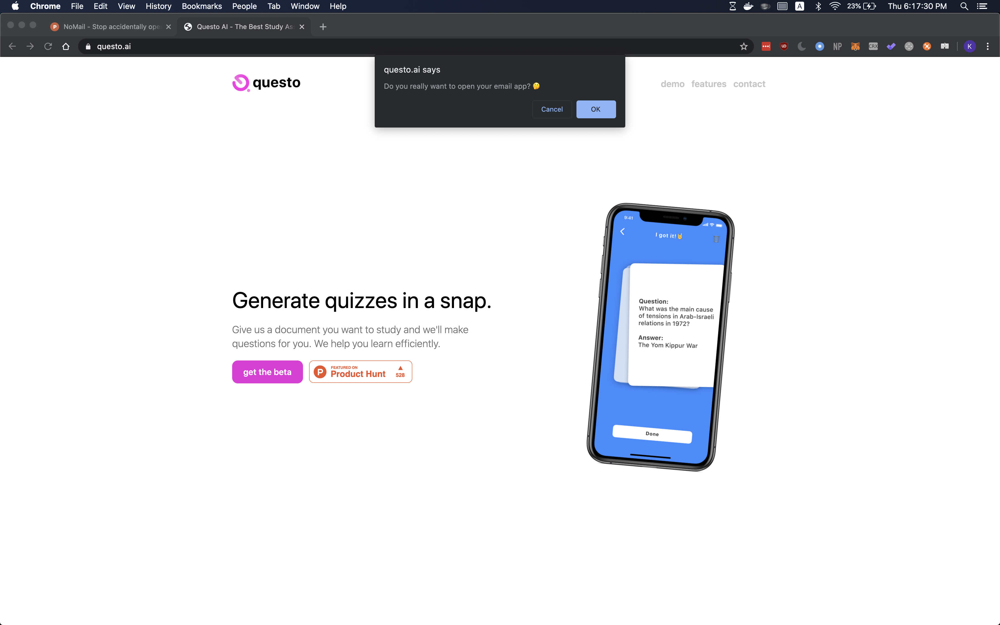

# NoMail 

Finally stop accidentally opening your mail client through email links😭

Instead of opening the Apple Mail client and making you want to kill yourself, we simply ask for confirmation when you click a `mailto` link. 

